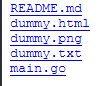

# sshttpd

Stupid Simple HTTP Daemon

sshttpd is a very tiny http daemon that is actually built upon the `http.Dir` function in Go. `http.Dir` can be used with `http.Handle`, and that can create an HTTPD!

## No index

If you don't have an index, you will get a very simplistic `Index of` page. Here's what it looks like:



## How to use

To use sshttpd, you specify 2 arguments. Argument 1 is the port, and Argument 2 is the directory. An example is:

```bash
sshttpd 80 .
```

You will also get a log when you run it. The log outputs along the lines of:

```
[Tue, 08 Mar 2022 17:25:52 MST] GET /
```

It will start serving on localhost.
